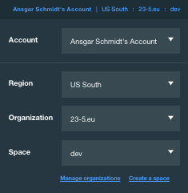

# BluemixDevEnv
IBM Bluemix cli development docker

docker run -it --rm                      \
-e BX_USERNAME=<Bluemix Username>        \
-e BX_PASSWORD=<Bluemix Password>        \
-e BX_ORG=<Bluemix Organisation>         \
-e BX_SPACE=<Bluemix Space>              \
-e BX_ACCOUNT_ID=<Bluemix Account ID>    \
-e WSK_AUTH=<Openwhisk Authentification> \
ansi/bluemixcli /bin/bash

